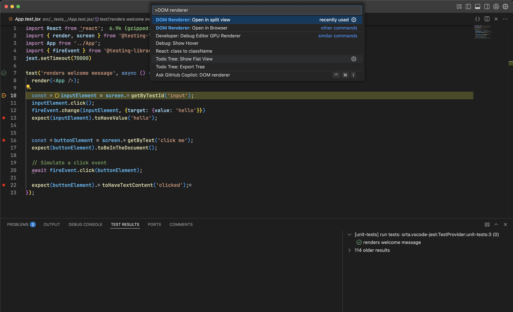

# Virtual DOM preview


This extension allows you to view the current state of your application during debug tests. It provides a WebView panel to render the DOM and an option to open it in a browser.

## Important

To properly render your application, you need to configure CSS handling in your test environment. If you're unsure how to do this, check out the ready-to-use template project with configured CSS support:  
[React Testing Library with CSS Template](https://github.com/hheimerd/rlt-with-css-template).

We recommend using the package `@hheimerd/jest-transform-css` for CSS transformation in your tests. This package is a temporary fork of `jest-transform-css` with added support for debugging. You can install it with:

```bash
pnpm add -D @hheimerd/jest-transform-css
```

## Usage

### Open in VSCode

1. Start a debug session in Visual Studio Code.
2. Run the command `DOM Renderer: Open in split view` from the Command Palette (`Ctrl+Shift+P` or `Cmd+Shift+P` on macOS).
3. A WebView panel will open beside your editor, displaying the DOM structure.



### Open in Browser

1. Run the command `DOM Renderer: Open in Browser` from the Command Palette.
2. Enter the port for the preview server (default is `6060`).
3. The DOM will open in your default browser.

### Open Developer Tools (Devtools)

To debug or inspect the WebView, you can open the Visual Studio Code Developer Tools:

1. Go to the menu: **Help** > **Toggle Developer Tools**.
2. In the Developer Tools window, navigate to the `Console` or `Elements` tab to inspect the WebView content.


